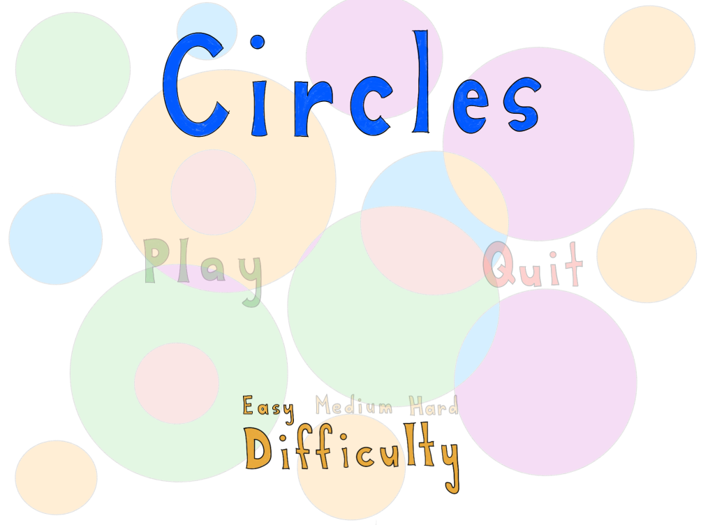
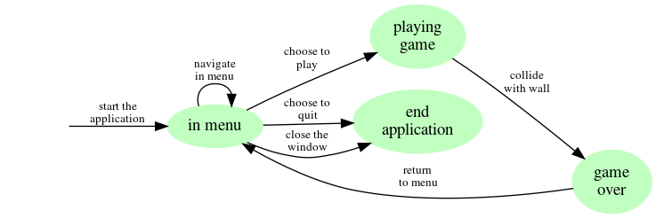

# Travail pratique 3 : Le jeu *Circles*

Dans ce troisième travail pratique, vous devez concevoir un jeu vidéo nommé
*Circles*, fortement inspiré du jeu [Super
Hexagon](https://www.superhexagon.com/) de [Terry
Cavanagh](https://en.wikipedia.org/wiki/Terry_Cavanagh_(developer)).
L'implémentation doit être faite à l'aide de la bibliothèque
[SDL2](https://www.libsdl.org/).

Notez que ce travail ne peut pas être réalisé sur le serveur Java, qui supporte
seulement les applications sur la console et pas les applications graphiques.

Le travail doit être réalisé **seul** ou en **équipe** d'au plus **3
personnes**. Il doit être remis au plus tard le **25 août 2020** à **23h59**.
À partir de minuit, une pénalité de **2% par heure** de retard sera appliquée.

## Note importante à propos du travail en équipe

Je me réserve la possibilité d'attribuer une note complètement différente
(pouvant aller jusqu'à zéro) à un membre d'une équipe dont le travail n'est pas
jugé suffisant. Pour cela, je considérerai la division des tâches et les
*commits* (quantité et qualité) qui ont été produits par chacun des membres
(Voir le phénomène du [passager
clandestin](https://fr.wikipedia.org/wiki/Passager_clandestin_(%C3%A9conomie))).

En revanche, je n'interviendrai pas au sein d'une équipe s'il y a des
situations conflictuelles. Ainsi, si par exemple une partie du travail n'est
pas complétée parce qu'un coéquipier n'a pas fait sa part, les autres membres
de l'équipe devront compenser, car le travail sera évalué de façon globale pour
toutes les équipes. Il est donc de votre responsabilité de vous assurer du bon
fonctionnement et de la dynamique des membres de l'équipe et d'identifier le
plus rapidement possible la personne de l'équipe qui ne participe pas.

## Objectifs spécifiques

Les principaux objectifs visés sont les suivants:

* **Construire** un logiciel fonctionnel en C à partir d'une coquille de
  départ
* **Planifier** le développement d'une application plus complexe de façon
  structurée
* Utiliser correctement un **logiciel de contrôle de version** pour
  **collaborer** (travailler en équipe)
* **Organiser** le développement (en équipe ou seul) à l'aide de branches et de
  requêtes d'intégration
* Se familiariser avec une **bibliothèque C graphique**;
* **Livrer** une application en facilitant sa **distribution** et son
  **utilisation**.

## Description du travail

Rendez-vous sur le dépôt public
[https://gitlab.info.uqam.ca/inf3135-ete2020/inf3135-ete2020-tp3](https://gitlab.info.uqam.ca/inf3135-ete2020/inf3135-ete2020-tp3),
clonez-le (avec *fork*) et assurez-vous qu'il soit privé. Donnez accès à votre
projet à l'utilisateur `blondin_al` en mode *Maintainer*. Si vous êtes en
équipe, un seul étudiant se charge de cloner le dépôt, de donner accès aux
autres membres de l'équipe ainsi qu'à l'enseignant.

À partir des fichiers déjà fournis, vous devez concevoir un jeu de type
« survie » (*survival*), dont le parcours est théoriquement infini (*infinite
runner*), en évitant le plus longtemps possible les obstacles qui se présentent
à vous. La figure ci-bas illustre la scène du jeu.


Plus précisément, le joueur est un triangle bleu. Les seuls déplacements qu'il
peut effectuer sont contraints autour du disque gris qu'on aperçoit au milieu
de la scène. Il peut se déplacer soit dans le sens horaire, soit dans le sens
antihoraire.

Au fur et à mesure que le temps avance, des obstacles, représentés par des arcs
rouges, se déplacent vers le centre de la scène. Le joueur doit éviter ces
obstacles. Si, à n'importe quel moment, le triangle et un arc de cercle sont en
contact, alors le joueur perd et l'application retourne au menu principal (voir
l'image ci-bas).



À noter que la conception d'un jeu vidéo requiert la maîtrise de certaines
notions théoriques sur les applications graphiques, la cinématique et les
automates finis (aussi appelés [machines à états
finies](https://en.wikipedia.org/wiki/Finite-state_machine)), détaillées un peu
plus bas.

## Applications graphiques

Le développement d'applications graphiques interactives se distingue des
applications consoles à plusieurs niveau :

- Il repose sur l'utilisation de fichiers multimédia comme des images, des
  fichiers audio ou encore des fichier vidéos
- Il doit tenir compte des interventions de l'utilisateur à travers divers
  périphériques, comme le clavier, la souris, les écrans tactiles
- Il doit gérer différents événements qui dépendent du temps, en utilisant
  notamment des chronomètres
- Il repose parfois sur l'utilisation de feuilles de sprites (en anglais,
  *spritesheets*), une matrice de plusieurs petites images regroupées en une
  seule

En particulier, la bibliothèque SDL est une bibliothèque de bas niveau, en
comparaison par exemple à Swing (Java). Elle n'offre pas de système de boutons,
de menu déroulant, de boutons radio, de gestion d'événements par défaut, etc.
Dans ce travail pratique, il est donc recommandé de simplifier au maximum cette
gestion si vous souhaitez compléter le projet dans le temps imparti. Voici
quelques suggestions (vous êtes évidemment libres de ne pas en tenir compte):

- N'utilisez que les événements clavier de l'utilisateur (pas d'événement
  souris, sauf quand on clique sur le `x` qui ferme la fenêtre du jeu)
- Utilisez les ressources graphiques fournies(mais n'hésitez pas à les modifier
  ou à en ajouter si vous êtes motivés, à la toute fin)
- Assurez-vous d'abord d'avoir une version fonctionnelle dans laquelle les
  objets sont statiques pour ensuite les animer

Une bonne façon de comprendre le fonctionnement de la bibliothèque SDL est de
vous familiariser avec la coquille de projet qui vous est fournie ou d'étudier
le [jeu Maze](https://bitbucket.org/ablondin-projects/maze-sdl). Quelques
remarques s'imposent par rapport à cette petite application:

- Dans ce travail pratique, vous n'aurez pas besoin des bibliothèques TMX et
  XML sur lesquelles est basée le jeu. Par contre, pour faire tourner le jeu
  Maze, vous devez installer TMX/XML.
- Il y a un module qui permet de gérer les feuilles de sprites. N'hésitez pas à
  le récupérer et à l'adapter à vos besoins (sans oublier de citer la source!).
- Étudiez soigneusement la façon d'implémenter les machines à états dans Maze,
  qui sont des patrons fondamentaux dans le développement d'applications
  graphiques (plus de détails dans une sous-section plus bas).

## Ressources graphiques

Toutes les ressources graphiques nécessaires pour le projet (sauf les figures
géométriques primitives de triangle, d'arc de cercle et de disque) sont
disponibles dans le répertoire `assets` du dépôt que vous devrez cloner.

* L'[arrière-plan du menu](images/background-small.png);
* Le [titre du menu](images/title-small.png);
* Les boutons [Play](images/play-small.png), [Quit](images/quit-small.png) et
  [Difficulty](images/difficulty-small.png);
* Les choix de diffculté [Easy](images/easy-small.png),
  [Medium](images/medium-small.png) et [Hard](images/hard-small.png);
* La feuille de sprite des [10 chiffres et du point](images/digits-small.png),
  utilisée pour l'affichage du chronomètre.

Tous les autres éléments du jeu sont des formes géométriques (triangle, disque,
secteurs de disque, arc de cercles) qui peuvent être générées à l'aide de la
bibliothèque [SDL-gfx](https://sourceforge.net/projects/sdl2gfx/).

## Automates

Dans les applications graphiques en général, la notion d'*état* est
primordiale. Le formalisme sans doute le plus utilisé pour modéliser les états
d'un système est l'automate fini, aussi appelé *machine à transition* ou
*machine à états*. Il s'agit essentiellement d'un graphe orienté, c'est-à-dire
un ensemble de *noeuds* ou *sommets*, qui représentent les différents états
possibles et d'un ensemble d'*arcs* (aussi appelés *flèches* ou *transitions*),
qui représentent les règles pour passer d'un état à un autre.

Voici un exemple d'automate illustrant les états possibles du jeu qu'on vous
demande de développer (vous pouvez évidemment en utiliser un autre):



Il y a donc 4 états possibles (les ellipses en vert pâle). Les actions qui
permettent de passer d'un état à l'autre sont représentées par des flèches. Par
exemple, lorsque le joueur est dans le menu (état *in menu*), il y a quatre
possibilité:

1. Naviguer dans le menu (transition *navigate in menu*) et alors on retourne
   dans l'état *in menu*;
2. Choisir l'option *play* (transition *choose to play*) et alors on passe
   à l'état *playing game*;
3. Choisir l'option *quit* (transition *choose to quit*) et alors on passe
   à l'état *end application*, qui correspond à la fin d'exécution de
   l'application;
4. Cliquer sur le `x` de la fenêtre (transition *close the window*) et alors on
   passe aussi à l'état *end application*.

En C, une façon naturelle de représenter les différents états possibles
consiste à utiliser un type énumératif, par exemple:

```c
enum menu_state {
    MENU_PLAY_FOCUS,       // Play choice has focus
    MENU_QUIT_FOCUS,       // Quit choice has focus
    MENU_DIFFICULTY_FOCUS, // Difficulty choice has focus
    MENU_PLAY,             // Play has been chosen
    MENU_QUIT              // Quit has been chosen
};
```

Ainsi, pour afficher le menu correctement, il suffit simplement de connaître
son état courant. On peut donc afficher de façon semi-transparente les options
non actives et afficher de façon opaque l'option actuellement active.

## Makefile et tests automatiques

Lors de la remise, vous devez inclure un fichier `Makefile` permettant de
compiler votre projet à l'aide de la commande

```sh
make
```

Par ailleurs, bien qu'il n'y ait pas de façon simple de tester de façon
automatique une application graphique (étant donné qu'elle demande une
participation interactive de la part d'un utilisateur), vous devez minimalement
ajouter un fichier `.gitlab-ci.yml` qui garantit que le projet compile
correctement à chaque fois que quelqu'un **pousse** une modification (bref, le
seul test est que le projet compile).  Un tel fichier ressemblerait à ceci (il
est possible que vous ayez à le modifier):

```yaml
before_script:
    - apt-get update -qq
    - apt-get install -y build-essential
    - apt-get install -y libsdl2-dev
    - apt-get install -y libsdl2-gfx-dev
    - apt-get install -y libsdl2-image-dev
    - apt-get install -y libsdl2-ttf-dev

build:
    stage: build
    script:
        - make
```

## Fichier README

Vous devez compléter le fichier README avec votre projet afin de documenter
différents aspects de celui-ci. Vous devez minimalement inclure les éléments
suivants, mais n'hésitez pas à en ajouter si nécessaire.

## Contraintes additionnelles

Afin d'éviter des pénalités, il est important de respecter les contraintes
suivantes :

- Le nom de votre projet doit être exactement `inf3135-ete2020-tp3`
- L'URL de votre projet doit être exactement
  `https://gitlab.info.uqam.ca/<nom utilisateur>/inf3135-ete2020-tp3`, où
  `<nom d'utilisateur>` est votre nom ou votre code MS.
- Aucune variable globale (à l'exception des constantes) n'est permise;
- Vos modifications doivent **compiler** sans **erreur** et sans
  **avertissement** lorsqu'on entre `make`.
- Vous devez donner accès en mode *Maintainer* à l'utilisateur `blondin_al`

Advenant le non-respect d'une ou plusieurs de ces contraintes, une pénalité de
**50%** pourra être appliquée.

## Remise

Votre travail doit être remis au plus tard le **25 août 2020** à **23h59**.  À
partir de minuit, une pénalité de **2% par heure** de retard sera appliquée.
La remise se fait **obligatoirement** par l'intermédiaire du [GitLab du
département](https://gitlab.info.uqam.ca/).

Les travaux ne pourront pas être corrigés sur le serveur Java, qui ne permet
pas d'exécuter une application graphique. Vous devez cependant vous assurer que
votre programme fonctionne **sans modification** sur au moins une distribution
Linux telle que Ubuntu ou Mint. Aucun travail ne sera corrigé sur **Windows**
ou **MacOS**.

## Barème

Votre travail sera évalué selon les critères de correction suivants (sur un
total de **100 points**)

### Fonctionnabilité (60 points)

Vous pouvez choisir parmi les éléments suivants n'importe quelle combinaison
afin d'obtenir un total de 60 points:

* Gestion du menu (navigation, affichage): **10 points**
* Affichage de la scène (triangle, murs, secteurs, disque): **10 points**
* Affichage du chronomètre: **10 points**
* Animation des murs: **10 points**
* Animation du joueur (triangle): **5 points**
* Détection des collisions: **5 points**
* Affichage d'une partie terminée (*game over*): **5 points**
* Gestion de difficulté: **5 points**
* Gestion de la musique principale: **5 points**
* Gestion des sons lorsqu'on navigue dans le menu: **5 points**
* Gestion de la musique de fin de partie (*game over*): **5 points**

**Note**: le total pour cette partie est plafonné à 60 points.

### Qualité de la remise (10 points)

* Le fichier `Makefile` permet de compiler le programme: **5 points**
* Il y a un fichier `.gitlab-ci.yml` qui permet de vérifier que le programme
  compile (c'est-à-dire que la commande `make` fonctionne): **5 points**

Optionnellement, vous pouvez ajouter des tests unitaires, mais aucun point ne
sera accordé à ces tests.

### Fichier README (10 points)

Le fichier `README` contient les éléments suivants:

* **Description**: un résumé du projet en quelques phrases, le contexte (cours,
  sigle, université, etc.)
* **Auteurs**: les auteurs, avec codes permanents
* **Dépendances**: quels sont les logiciels et les bibliothèques à installer
  pour faire fonctionner l'application
* **Fonctionnement**: décrire les commandes pour compiler le projet, pour
  lancer l'application et, une fois démarrer, quelles sont les touches
  permettant de faire un choix dans le menu et de jouer.
* **Plateformes supportées**: indiquez les distributions sur lesquelles vous
  avez développé le jeu
* **Références**: s'il y a lieu, indiquez les références utilisées pour le
  projet
* **Division des tâches**: indiquez comment le travail a été divisé et quelle
  personne a fait quelle tâche. Il n'est pas nécessaire de tout faire en
  détails, mais il faut minimalement indiquer les tâches pour lesquelles des
  points sont accordées dans la partie « Fonctionnabilité ».
* **État du projet**: indiquez si le projet est fonctionnel, s'il y a des
  limitations.

### Gestion du projet (20 points)

* Les modifications devraient être ajoutées par **requêtes d'intégration**,
  afin de bien structurer le développement. Notez que le texte qui explique la
  requête d'intégration n'a pas à être aussi détaillé que pour le 2e travail
  pratique, une courte explication étant suffisante.
* Si vous êtes en **équipe**, vous pouvez désigner un membre unique de
  l'équipe comme celui qui accepte ou refuse les requêtes d'intégration (il
  joue le rôle du *release manager*). Il est aussi acceptable d'intégrer une
  requête d'intégration dès qu'au moins deux personnes différentes l'ont
  évaluée.
* Si vous travaillez **seul**, vous devez tout de même structurer vos
  modifications à l'aide de requêtes d'intégration, que vous accepterez
  vous-même. C'est sûr que c'est un peu plus artificiel, mais ça permet au
  moins de bien étudier, rétroactivement, le développement de votre
  programme. En particulier, assurez-vous de laisser toutes les branches que
  vous avez utilisées et fusionnées sur le dépôt afin qu'on puisse les
  étudier si nécessaire.
